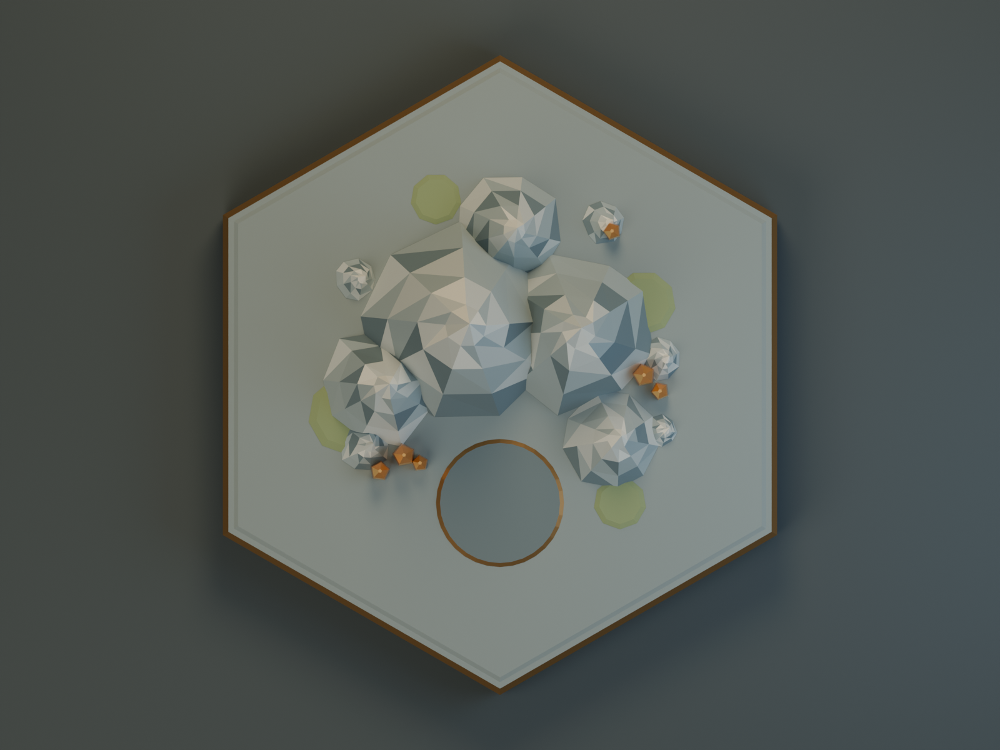
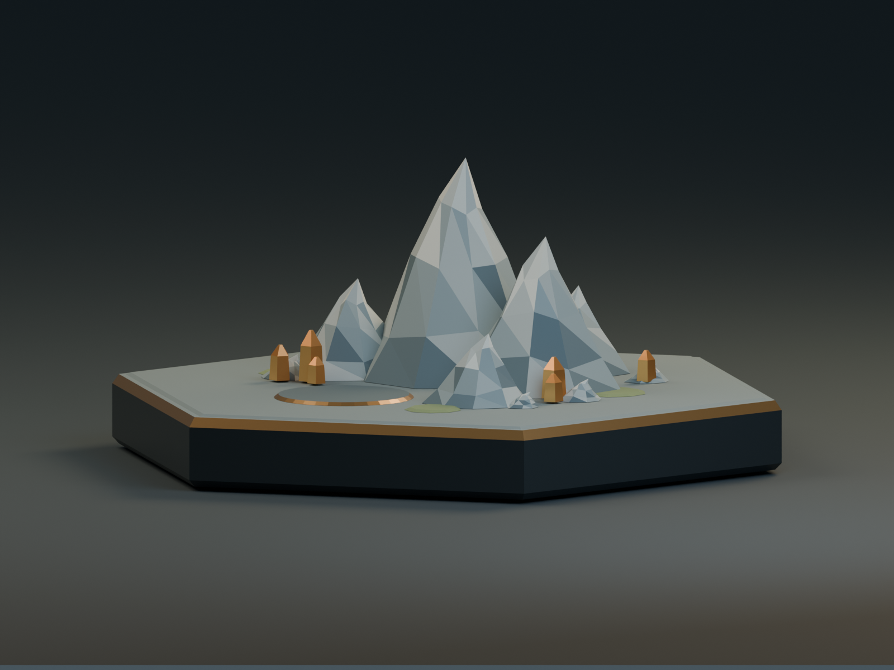
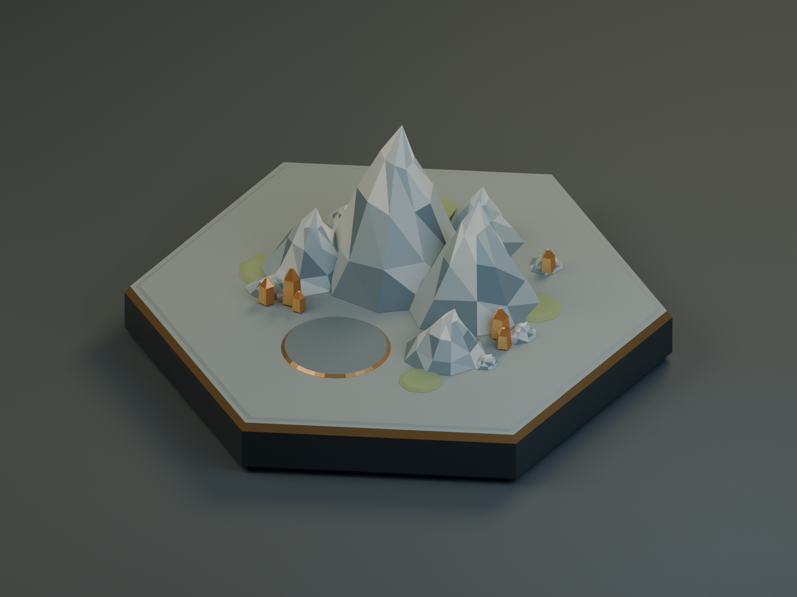
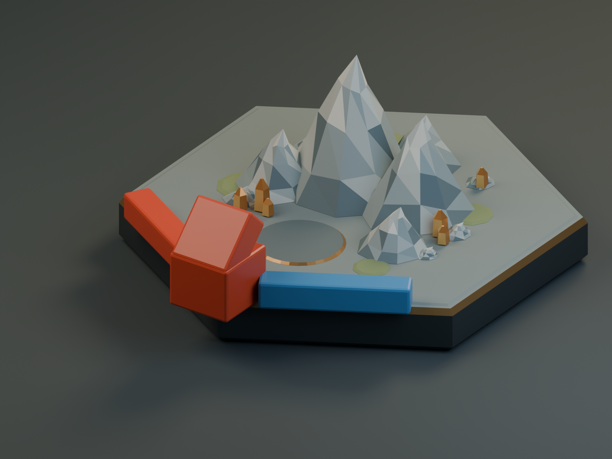

# M1 山地立体样板

`mountain-tile-v001` 是可重新生成的原创山地网格，采用低多边形层岩、铜色矿晶、深色底座和青铜镶边。它用于验证收藏版地形的比例、遮挡和导入路线。没有使用用户照片、扫描件或现成模型，也没有生成位图后将其声称为 3D 模型；实物版本和实测尺寸仍未知，不能作为实体收藏版的复刻验收。

M0 的 [v001 估算参数](../art/recipes/v001/scale-estimates.json) 原样保留。新样板配方独立保存在 [recipe.json](../art/recipes/mountain-tile-v001/recipe.json)，材质版本为 `metallic-stone-v001`，固定种子为 `20251008`。

## 交付文件

| 内容 | 路径 |
| --- | --- |
| Blender 建模与固定相机脚本 | [generate_mountain.py](../tools/art/generate_mountain.py) |
| 一键生成并回读验证 | [Build-Mountain.ps1](../tools/art/Build-Mountain.ps1) |
| 独立 FBX 回读验证 | [verify_mountain.py](../tools/art/verify_mountain.py) |
| 可编辑源文件 | [mountain-tile-v001.blend](../art/source/mountain-tile-v001/mountain-tile-v001.blend) |
| Unity 导入网格 | [mountain-tile-v001.fbx](../art/exports/mountain-tile-v001/mountain-tile-v001.fbx) |
| 来源、几何、材料、坐标和导出参数 | [manifest.json](../art/exports/mountain-tile-v001/manifest.json) |
| FBX 检查结果 | [verification.json](../art/exports/mountain-tile-v001/verification.json) |
| 干净目录重建结果 | [rebuild-verification.json](../art/exports/mountain-tile-v001/rebuild-verification.json) |

样板包含 24 个闭合网格、644 个源顶点、1,192 个三角形和 11 种常量 PBR 材质。每个网格有确定性盒式投影 UV。材质没有外部图片依赖，因此不需要附带不存在的贴图；未来使用烘焙纹理时应在新材质版本中登记。`.blend` 包含可直接重渲染的相机、灯光和预览道具；FBX 只导出 `Mountain_` 网格，不带灯光、相机、测试棋子或碰撞体。

本次单个二进制文件约 0.13–2 MB、总量不足 10 MB，作为首件小样直接纳入 Git；保留脚本与参数作为重建依据。正式批量生产前再配置 Git LFS 或独立备份，不在本阶段隐式改变仓库的远程存储设置。

## 尺度与接入

全部尺寸为工作估算。正六边形边长 40 mm，Blender 中顶点起角为 30°，底座名义高度 8 mm，地面表层厚 0.25 mm，棋子摆放基准仍为 8 mm。总高 33.5 mm，低于 36 mm 上限。最高峰位于地块后半；前方保留数字盘，字符和规则数字由游戏代码生成。

所有导出对象的原点都在地块底面中心，位置为零、旋转为零、缩放为一。Blender 使用米制 Z 向上；显式 FBX 参数为 `axis_forward=-Z`、`axis_up=Y`、`global_scale=1`、`apply_unit_scale=true`、`apply_scale_options=FBX_SCALE_UNITS`。Unity 应使用 1 单位等于 1 米，导入缩放为 1。

| 检查项 | 期望值 |
| --- | --- |
| Unity 整体尺寸 X / Y / Z | 0.069282 / 0.0335 / 0.08 m |
| Unity 底面中心与底面 | 原点 `(0,0,0)`，最低 Y 为 0 |
| Unity 棋子摆放平面 | Y = 0.008 m |
| Unity 数字盘中心 | `(0,0.009,0.016)` m；导入时须以实际 FBX 朝向复核 |
| 景观距六边形边最小值 | 8.437 mm，要求至少 6 mm |
| 景观距六个顶点最小值 | 15.491 mm，要求至少 9 mm |

`manifest.json` 按材质名记录线性 RGBA、粗糙度和金属度。Unity 应显式重建 URP/Lit 材质，粗糙度转为 `smoothness = 1 - roughness`；不要依赖 Blender 节点自动转换。按 Unity 色彩空间/API 约定正确处理清单中的线性色值。地形子对象可统一控制显隐或淡化；规则落点和拾取目标应使用稳定的 Tile、Vertex、Edge 标识，地形网格不参与规则验证，也不拦截节点选择。

## 四种固定预览

下列图像由 Blender 4.5.14 LTS 的 Cycles 渲染，1600 × 1200、48 samples。相机、灯光和颜色管理参数随脚本保存。这些是美术检查图；Unity 中的实际相机、材质、拾取与遮挡由 M1 运行验收另行记录。

| 顶视：边缘留空与数字盘 | 侧视：高度与底座 |
| --- | --- |
|  |  |

| 默认游戏方向：山体层次 | 拥挤节点：棋子与景观间距 |
| --- | --- |
|  |  |

拥挤节点图使用按估算尺寸生成的预览道路和定居点；它是占地检查，不代表合法对局。四图已逐张查看，山体轮廓、前侧数字盘和前侧棋子可辨认；这不等于用户已确认美术风格，也不代替 Unity 默认/俯视视角与缩放后的交互验证。

## 重建与验证

在项目根目录执行，输出目录须为新目录：

```powershell
powershell -NoProfile -ExecutionPolicy Bypass -File .\tools\art\Build-Mountain.ps1 -OutputRoot .local\art-rebuild-v001 -CompareRoot art
```

脚本读取已固定的 Blender 路径，在新目录创建 `source`、`exports` 和 `previews`，生成网格与四图，随后在独立 Blender 进程中回读 FBX。输出版本目录已经存在时会拒绝覆盖；再次运行时使用新的输出根目录，不删除或改写原始参考。只检查网格时可以加 `-SkipPreviews`，但四图齐全的交付验收不应省略预览。

独立检查重新计算导出模型的尺寸、底心枢轴、每个景观顶点的边/顶点间距、三角面面积、闭合边、UV、材料及贴图依赖。重建比较几何/UV/材料签名、来源脚本与配方 SHA-256、随机种子、边界及导出参数。FBX 和 `.blend` 容器可能包含不同的保存时间，不能用容器逐字节相同代替实际资产内容相同。

2026-10-08 已从干净的 `.local/art-release-v001` 生成正式交付，再从另一个干净的 `.local/art-rebuild-v001` 完整生成源文件、FBX 和四图。两次均通过独立 FBX 回读；重建内容比较一致，结果保存在 `rebuild-verification.json`。正式目录另行回读通过，源文件 SHA-256 与四张 PNG 的格式/分辨率也已核对。日志位于 `.local/art-validation/20261008-231943-835-*` 与 `20261008-232204-130-*`；首次草稿曝光过高，预览光照已修正后重新生成。

Unity 导入、正式相机和节点拾取的验证由 M1 总验收记录给出，不能从 Blender 检查推断其通过。用户实物匹配、用户审美验收、整桌性能预算和后续批量生产不在本件自动检查的结论内。
