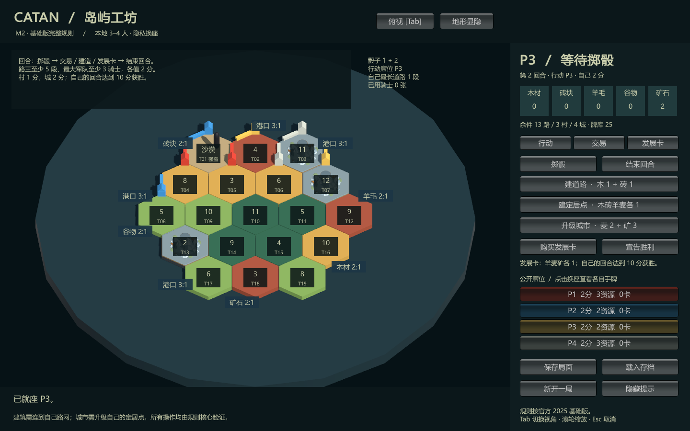

# M2 实施与验收记录

记录日期：2026-10-09（Asia/Shanghai）。M2 的完整对局、规则逐项案例、关键边界、存档与 Unity 兼容验收已通过。这里的完成依据是已执行的工程验收与窗口检查；不表示用户已经亲自玩完整局，也不代替 M1 尚待取得的用户试玩和收藏版美术确认。

## 交付

- `Catan.Core.M2.BaseGameSession`：独立于 Unity 的完整基础版规则、稳定拓扑、随机地图/先手/骰子/发展卡、有限供应和统一命令入口。
- 开局、产出与短缺、城市、银行/港口/玩家交易、7 与弃牌/强盗/偷取、五类发展卡、最长道路、最大军队、隐藏胜利点与当前回合 10 分胜利。
- 本地 3–4 人 Unity 客户端：隐私换座、所有待决选择、合法位置预览、取消、中文规则提示、保存与恢复。
- 权威存档格式 `2`，规则 `catan-base-2025-en-v1`，场景 `m2-base-game / m2-random-board-v001`；从初始种子与已确认命令重放校验。M1 的规则和存档入口保持独立。
- Windows 程序 `.local/m2/Builds/Windows/CatanM2.exe`，以及 [启动和操作说明](M2_PLAYTEST.md)、[接口与权限说明](M2_ARCHITECTURE.md)、[条款与案例对应清单](M2_RULES_CHECKLIST.md)。

## 阶段退出条件

| 路线图要求 | 已执行的证据 | 结论 |
| --- | --- | --- |
| 从开局到胜利的完整对局 | 3 人 seed 1：P1 在第 59 回合、220 条成功指令后获胜；4 人 seed 2：P3 在第 62 回合、240 条指令后获胜。两局均从正式 `Create` 开始，策略只读 `PlayerView`，只经 `Execute` 行动 | 通过 |
| 基础版规则清单逐项验收 | 官方 2025 规则第 3、6–12 页对应 M2-R01–R20；固定预期案例覆盖全部卡牌、费用、阶段、短缺、供应、港口、交易、道路与奖牌边界 | 通过 |
| 关键边界和存档通过测试 | 非法指令原子拒绝、重试去重、ID 冲突、隐藏信息与引用隔离、未知版本/篡改拒绝、所有待决保存/恢复、后续指令完全一致及终局重放 | 通过 |
| 隐私换座与最低规则提示 | Windows 实际运行中验证换座清除私有视图/资源选择；真实鼠标检查确认席位、合法建村、非法道路、取消、保存、加载后遮罩；完整界面截图检查中文提示与行动入口 | 通过；人工范围见下文 |
| Unity 兼容性 | 固定 Unity 6000.3.25f1 导入执行核心 Create/Save/Load，脚本编译，Windows x64 Mono 构建，两个独立玩家进程实际保存/恢复 | 通过 |

## 实际测试

最终统一运行 `Test-M2Rules.ps1`：**138/138 通过，0 失败**，其中 M1 原有 55 项、M2 新增 83 项。核心目标仍为 .NET Standard 2.1、C# 9；编译 0 警告、0 错误。[最终 TRX](verification/m2-2026-10-09/m2-rules.trx) 是完整结果。

每个完整对局都实际进入并恢复了开局道路、弃牌、强盗移动、偷取、道路建设五类待决阶段；恢复后对同一下一指令比较完整权威存档。交易提案另有正式可重放局面的独立保存/接受测试。无假手牌、强制胜利或修改状态捷径参与完整局驱动。受控边界测试使用测试工程内部反射夹具，正式 Load 明确拒绝这种任意改写的局面。

地图生成按官方组件图第 3 页的六块海框整体洗牌，保留每片固定港口组合；第 11 页的 A–R 数字沿逆时针螺旋排列并跳过沙漠。独立海框测试覆盖五个种子，检查 30 条连续海岸边、每片五边、九个港口、印刷资源身份与局部边位置。没有把九个港口拆开随意洗牌。

Unity 构建日志包含 `CATAN_M2_UNITY_CORE_OK` 和 `CATAN_M2_UNITY_BUILD_OK`。Windows 保存与恢复日志分别包含 `CATAN_M2_PLAYER_SAVE_OK` 和 `CATAN_M2_PLAYER_LOAD_OK`，验证实际 UI 方法提交、非法落点存档不变、取消、加载错误保留原局、换座清空、3/4 人开局、随机继续、换地图后地形重建与相机偏好。点/边/地块在两种视角及缩放上下限的中心选择全部通过。

渲染运行于 AMD Radeon RX 9070 XT、D3D11。默认和俯视相机输出通过彩色棋盘像素检查；可见窗口的完整 GUI 输出通过非黑像素检查，并由代理实际查看。隐藏窗口最初生成的黑色 GUI 图已排除，未当成通过证据。只渲染相机的图片不包含 IMGUI，下面的完整图来自单独的可见窗口验证。

Unity Editor 正常退出时仍有已有的 Mono 调试线程清理/监听诊断，最后明确返回 0；玩家日志没有未处理异常。本次 .NET 测试进程通信和 Unity 许可访问在沙箱内受限，实际成功记录来自获准的沙箱外执行；没有修改防火墙或系统安全设置。

## 实际查看与未验证范围

代理通过真实 Windows 窗口确认席位、拿起并合法放置一个定居点、在远离锚点处放路并看到拒绝提示、用 Esc 取消、点击保存与载入并看到待放道路状态恢复及手牌遮罩。还检查了普通窗口和最大化窗口。程序内自动检查与真实鼠标操作分别记录，没有把自动调用当作人工点击。

完整 GUI 已检查行动页、资源显示、公开席位、港口/数字标记和中文规则提示；默认/俯视图已查看。尚未由用户玩完整局，未用真实鼠标逐个遍历全部卡牌/交易/弃牌面板，未做长时间性能采样、1080p 稳定 60 FPS 统计、多人可用性或美术成品验收。对应规则流程均有独立测试；当前完整对局证据是自动化对局。



M1 山地样板继续使用已标注的估算尺度；城市和强盗为可辨识的基础网格占位。用户实体版本、照片和实测尺寸仍未补齐；本次未替用户确认这些资料或美术取舍。扩展、AI 对手、联机及最终美术分别属于 M3–M8。

## 复验与证据

```powershell
powershell -NoProfile -ExecutionPolicy Bypass -File .\tools\validation\Test-M2Rules.ps1
powershell -NoProfile -ExecutionPolicy Bypass -File .\tools\development\Build-M2.ps1 -VerifyPlayer
# 显示一次窗口以生成完整 GUI 图；生成后还须实际查看布局：
powershell -NoProfile -ExecutionPolicy Bypass -File .\tools\development\Build-M2.ps1 -VerifyPlayer -CaptureUI
```

公开验收资料保存在 `docs/verification/m2-2026-10-09/`：[Unity 构建日志](verification/m2-2026-10-09/unity-build.log)、[保存进程](verification/m2-2026-10-09/player-save.log)、[恢复进程](verification/m2-2026-10-09/player-load.log)、[可见窗口截图验证](verification/m2-2026-10-09/player-ui.log)、[文件 SHA-256](verification/m2-2026-10-09/sha256.json)。完整权威存档留在 `.local/m2/verification`，不复制到公开日志或版本化证据目录。
